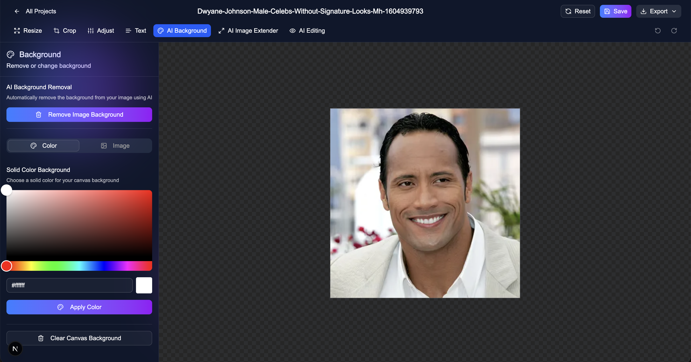

# Pixxel - AI-Powered Image Studio

Pixxel is a professional-grade image manipulation platform that combines the power of **Fabric.js** with cutting-edge **AI capabilities** for seamless background removal, image extension, and creative editing.


## ✨ Features

- **🤖 AI-Powered Tools**: One-click background removal, generative image extension, and smart AI editing.
- **🎨 Professional Canvas**: Full-featured editing suite powered by Fabric.js — resize, crop, filters, and text.
- **☁️ Cloud Backend**: Real-time data synchronization with Convex and secure authentication via Clerk.
- **🚀 Ultra-Fast UX**: Built with Next.js 15 and styled with Tailwind CSS & Shadcn UI for a premium, responsive experience.



## 🛠️ Tech Stack

- **Framework**: [Next.js 15](https://nextjs.org/)
- **Backend**: [Convex](https://www.convex.dev/)
- **Auth**: [Clerk](https://clerk.com/)
- **Canvas**: [Fabric.js](http://fabricjs.com/)
- **Styling**: [Tailwind CSS](https://tailwindcss.com/) & [Shadcn UI](https://ui.shadcn.com/)
- **Storage**: [ImageKit](https://imagekit.io/)

## 🚀 Getting Started

1. **Clone the repository:**
   ```bash
   git clone https://github.com/princesinghrajput/pixxel-image-studio.git
   ```

2. **Install dependencies:**
   ```bash
   npm install
   ```

3. **Set up Environment Variables:**
   Create a `.env.local` file with your Clerk, Convex, and ImageKit credentials.

4. **Run the development server:**
   ```bash
   npm run dev
   ```

---
Built with ❤️ by [princesinghrajput](https://github.com/princesinghrajput)
